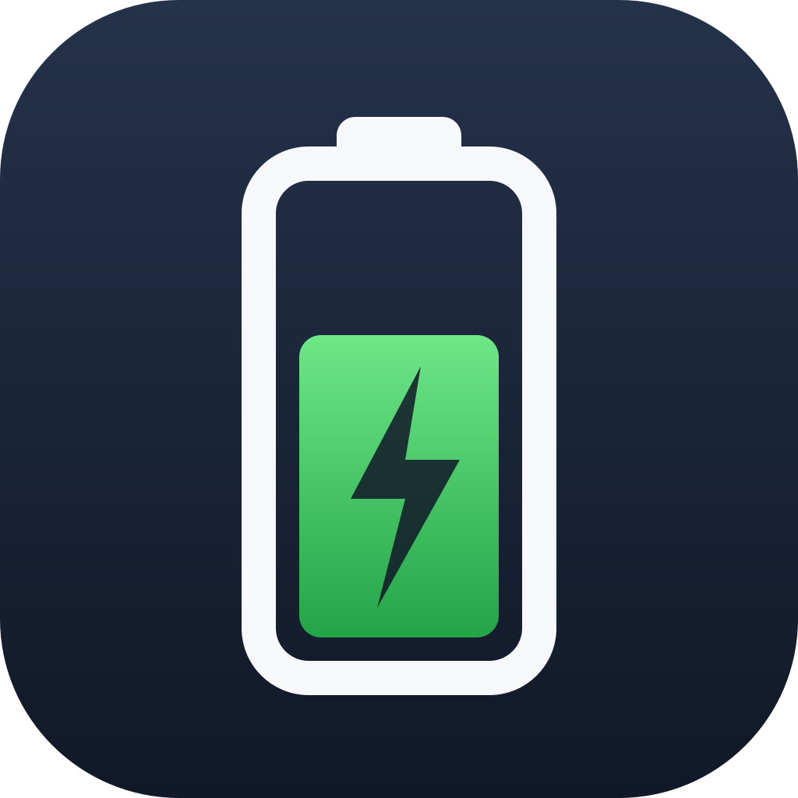
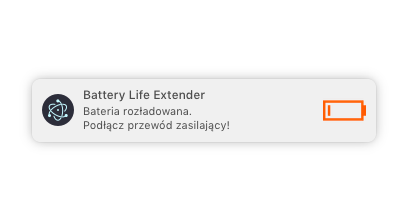
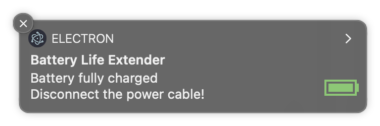

<div align="center">



</div>

# Battery Life Extender 🔋

<!-- prettier-ignore-start -->

[](https://github.com/piecioshka/battery-life-extender/actions/workflows/ci.yml)
[](https://github.com/piecioshka/battery-life-extender/actions/workflows/release.yml)
[](https://github.com/piecioshka/battery-life-extender/releases/latest)
[](#installation)
[](https://www.electronjs.org/)
[](#features)
[](https://piecioshka.mit-license.org)

<!-- prettier-ignore-end -->

🔋 **Know when to plug the charger in and when to pull it out.**

A macOS menu bar app that notifies you about battery health: when the level drops below 15% and when it is almost full.

## Preview 🎉




## Features

- 🪫 Notifies you to plug the charger in when the battery drops below 15%
- 🔌 Notifies you to unplug it when the battery is almost full (97%)
- 📍 Lives in the menu bar, no Dock icon and no window
- 🚀 Starts automatically after you log in

## Requirements

macOS only: the battery level and the power source come from `pmset -g batt`.

## Installation

1. Download the `*.dmg` for your Mac (`arm64` for Apple silicon, the one without an architecture for Intel) from the [latest release](https://github.com/piecioshka/battery-life-extender/releases/latest)
2. Open it and drag **Battery Life Extender** to Applications
3. The app is ad-hoc signed, not notarized: on first launch open System Settings > Privacy & Security and click **Open Anyway**

The app starts automatically after you log in.

## Development

```bash
npm install
npm start
```

`npm start` runs the app from the terminal with debug logs (the battery is checked every 60 seconds).

> [!NOTE]
> Since Electron 42 macOS shows notifications only from a signed app. The Electron binary behind `npm start` is unsigned, so its notifications fail silently. To see them, build the app and open the ad-hoc signed `dist/mac-arm64/Battery Life Extender.app`. The packaged app registers itself as a login item: remove it in System Settings > General > Login Items when you are done.

## Unit tests

```bash
npm test
```

Unit tests use the built-in `node:test` runner and do not start Electron.

## Build

```bash
npm run build:mac
```

Installers (`*.dmg` and `*.zip` for Apple silicon and Intel) land in `dist/`. `npm run build` does the same.

## CI

GitHub Actions workflow `.github/workflows/ci.yml` checks formatting and runs the tests on every push and pull request.

`.github/workflows/release.yml` builds the installers on `macos-latest` with `npm run build:mac` and verifies the ad-hoc signature. Started by hand from the Actions tab, it only uploads the installers as workflow artifacts.

## Release

```bash
npm version patch
git push --follow-tags
```

`npm version` bumps `package.json` and creates the `vX.Y.Z` tag. A pushed tag runs the release workflow: the `release` job checks that the tag matches the `package.json` version and publishes the installers as a GitHub release.

## License

[The MIT License](https://piecioshka.mit-license.org) @ 2026
