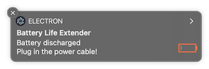
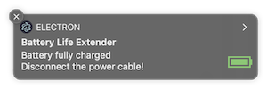

# battery-life-extender

:computer: macOS desktop app used good practice to extend battery health.

## Demo 🎉




## Features

* :white_check_mark: Display notification when the battery level is less than 15%
* :white_check_mark: Display notification when the battery level is almost 100%
* :white_check_mark: Display icon in the menubar (helpful for quit from the app)

## Installation

1. Download `*.zip` file from <https://github.com/piecioshka/battery-life-extender/releases>
2. Unzip
3. Move `*.dmg` file to Applications
4. Run `Battery Life Extender.dmg`

The app will be running when system staring.

## How to close the app?

Kill process with a name `Battery Life Extender`.

## How to develop?

```bash
npm install
npm start
```

## Unit tests

```bash
npm test
```

## Code coverage

```bash
npm run coverage
```

## License

[The MIT License](http://piecioshka.mit-license.org) @ 2019
